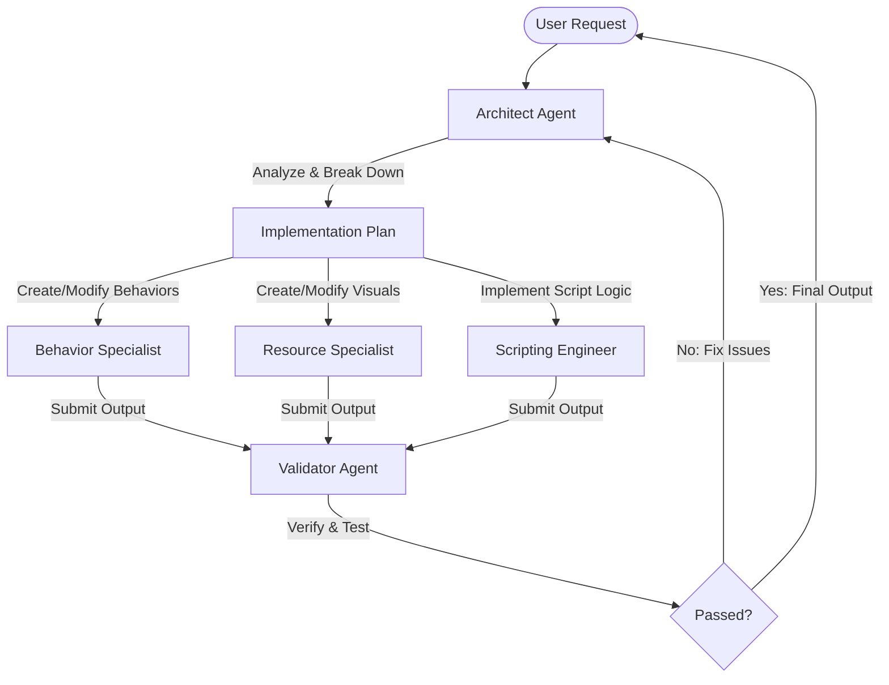

# Minecraft Bedrock Modding AI Agent System

This document outlines the roles, responsibilities, workflows, and specifications for AI agents designed to build and maintain Minecraft Bedrock Edition mods (Add-ons). 

---

## 1. Minecraft Bedrock Add-on Overview
Minecraft Bedrock Add-ons are composed of two primary components:
1. **Behavior Packs (BP)**: Define the logic, properties, and behaviors of entities, items, blocks, recipes, loot tables, animations, and scripts.
2. **Resource Packs (RP)**: Define the visual representation, including textures, models, sounds, UI, client entities, particles, and language files.

Modern Bedrock modding heavily leverages the **Minecraft Scripting API** (`@minecraft/server` and associated modules) written in JavaScript or TypeScript.

---

## 2. AI Agent Roles & Specifications

### 🤖 Architect Agent (The Coordinator)
*   **Role**: Coordinates the modding process. Translates high-level user feature requests into technical tasks and delegates them to specialist agents.
*   **Key Responsibilities**:
    *   Design the architectural layout of the mod.
    *   Generate and maintain the `manifest.json` files for both Behavior and Resource packs.
    *   Generate UUIDs (Universally Unique Identifiers) for manifests and maintain dependencies between BP and RP.
    *   Manage versioning (`format_version` and mod versions).
*   **Output**: High-level design documents, step-by-step task lists for specialists, manifest configurations.

### 🧱 Behavior Specialist Agent
*   **Role**: Creates and modifies game logic components represented in Behavior Pack JSON.
*   **Key Responsibilities**:
    *   Write and modify entities (`entities/*.json`), blocks (`blocks/*.json`), and items (`items/*.json`).
    *   Configure components, component groups, and event triggers (e.g., `minecraft:health`, `minecraft:damage_sensor`).
    *   Create loot tables (`loot_tables/*.json`), recipes (`recipes/*.json`), and trade tables (`trading/*.json`).
    *   Write server-side animation controllers and animations.
*   **Output**: Well-formatted, schema-compliant Behavior Pack JSON files.

### 🎨 Resource Specialist Agent
*   **Role**: Manages the visual, audio, and client-side presentation elements.
*   **Key Responsibilities**:
    *   Define client entity configurations (`client_entities/*.json`) mapping behaviors to models and textures.
    *   Configure render controllers (`render_controllers/*.json`) and materials.
    *   Generate or modify block and item texture mappings (`textures/terrain_texture.json`, `textures/item_texture.json`).
    *   Coordinate asset paths for textures, models (Geo JSON), particles, and sounds.
*   **Output**: Resource Pack JSON configs, texture reference tables, client-side animations.

### 📜 Scripting Engineer Agent
*   **Role**: Writes high-performance JavaScript/TypeScript code using the Bedrock Scripting API.
*   **Key Responsibilities**:
    *   Write scripts in the `scripts/` directory targeting `@minecraft/server`, `@minecraft/server-ui`, etc.
    *   Subscribe to game events (e.g., `world.afterEvents.playerInteractWithEntity`, `system.runInterval`).
    *   Implement custom gameplay mechanics, dynamic GUIs, custom block behaviors, and complex boss battles.
    *   Maintain script performance, avoiding excessive tick loops and memory leaks.
*   **Output**: JavaScript/TypeScript source code, build scripts (if using TypeScript/bundlers).

### 🔍 Validator / QA Agent
*   **Role**: Validates JSON syntax, schema compliance, API versions, and cross-pack consistency.
*   **Key Responsibilities**:
    *   Validate all JSON files against official Bedrock schemas.
    *   Ensure all referenced textures, models, and sounds exist in the Resource Pack.
    *   Verify UUID compatibility and check that dependency versions in `manifest.json` match.
    *   Check for deprecations or syntax errors in Scripts.
*   **Output**: Validation reports, error/warning lists, syntax corrections.

---

## 3. Recommended Project Directory Structure

AI agents must adhere to the standard Bedrock Add-on workspace structure:

```text
minecraft_mod/
├── .minecraft/                # Local testing environment links (optional)
├── behavior_packs/
│   └── MyModBP/
│       ├── manifest.json      # BP Manifest with dependency to RP
│       ├── entities/          # Entity behavior JSONs
│       ├── blocks/            # Custom block behaviors
│       ├── items/             # Custom item behaviors
│       ├── recipes/           # Crafting recipes
│       ├── loot_tables/       # Drop tables
│       └── scripts/           # Bedrock Scripting API files (JS/TS)
│           └── main.js
└── resource_packs/
    └── MyModRP/
        ├── manifest.json      # RP Manifest
        ├── pack_icon.png      # Mod Icon
        ├── client_entities/   # Client entity setup
        ├── models/
        │   └── entity/        # Custom 3D Bedrock Geometry (JSON)
        ├── textures/
        │   ├── blocks/
        │   ├── items/
        │   ├── terrain_texture.json
        │   └── item_texture.json
        └── texts/
            └── en_US.lang     # Localization file
```

---

## 4. Workflows & Collaboration Protocol



1. **Step 1 (Ingestion)**: The **Architect** receives the user's prompt (e.g., "Add a fire-breathing dragon mount").
2. **Step 2 (Planning)**: The **Architect** determines the needed files:
   - Entity behavior file (`behavior_packs/MyModBP/entities/dragon.json`).
   - Client entity file (`resource_packs/MyModRP/client_entities/dragon.json`).
   - Geometry and texture mappings.
   - Script event handler for mounting and fire-breathing.
3. **Step 3 (Delegation)**:
   - **Behavior Specialist** creates the dragon behavior entity.
   - **Resource Specialist** sets up client entity configuration and points to geometry/textures.
   - **Scripting Engineer** implements input listeners or tick loops for the dragon behavior.
4. **Step 4 (Verification)**: The **Validator** reviews files for schema errors, missing links, and script reference errors.

---

## 5. Development Guidelines & Rules for Agents

- **UUID Generation**: Always generate fresh, unique UUIDs for manifests (`version 2` or `version 4`). Never duplicate UUIDs from other templates.
- **Minification**: Keep JSON human-readable (with indentation) to allow easier debugging and code review.
- **Manifest Dependencies**: The `behavior_packs/.../manifest.json` must contain a dependency pointing to the exact UUID and version of the corresponding `resource_packs/.../manifest.json`.
- **Script Module Imports**: Use ESM imports for scripting:
  ```javascript
  import { world, system } from "@minecraft/server";
  ```
- **File Naming**: Use `snake_case` for all resource/behavior files, directories, and identifiers. Use `camelCase` for JavaScript variables and functions.
